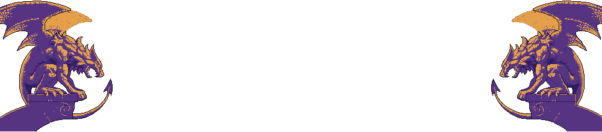

# 2D MonoGame Tower Defense



## Table of Contents
- [About](#about)
- [Features](#features)
- [Getting Started](#getting-started)
- [Prerequisites](#prerequisites)
- [Installation](#installation)
- [Usage](#usage)
- [License](#license)
- [Contact](#contact)
- [Acknowledgements](#acknowledgements)

## About
This is a 2D Tower Defense game developed using MonoGame. In this game, players strategically place towers to defend against waves of enemies. Each tower has unique abilities and upgrade paths. The goal is to prevent enemies from reaching the end of the path.

## Features
- Multiple tower types with unique abilities
- Different enemy types with varying behaviors
- Upgradable towers and abilities
- Diverse levels with increasing wave difficulty
- Pixel-art graphics with 8bit music

## Getting Started
Follow these instructions to get a copy of the project up and running on your local machine for development and testing purposes.

### Prerequisites
- [MonoGame](https://www.monogame.net/)
- [Visual Studio](https://visualstudio.microsoft.com/) or [Visual Studio Code](https://code.visualstudio.com/)
- .NET Core SDK
- DirectX

### Installation
1. **Clone the repository:**
    ```sh
    git clone https://github.com/Hamdi-Almahfali/MobSlayer.git
    ```
2. **Navigate to the project directory:**
    ```sh
    cd MobSlayer
    ```
3. **Restore the dependencies:**
    ```sh
    dotnet restore
    ```
4. **Build the project:**
    ```sh
    dotnet build
    ```

### Usage
1. **Run the game:**
    ```sh
    dotnet run
    ```

2. **Gameplay Instructions:**
    - Start a new game from the main menu.
    - Use the mouse to select and place towers on the map.
    - Upgrade towers by clicking on them and selecting upgrade options.
    - Defend against waves of enemies and prevent them from reaching the end of the path.

## License
Distributed under the MIT License. See `LICENSE` for more information.

## Contact
Discord - [@outlawvl](https://discord.gg/Y55Ydchrnz)

Project Link: [Dragon Hunter](https://github.com/Hamdi-Almahfali/MobSlayer)

## Acknowledgements
- [MonoGame](https://www.monogame.net/)
- [OpenGameArt](https://opengameart.org/) for free assets
- [SoundBible](http://soundbible.com/) for sound effects
